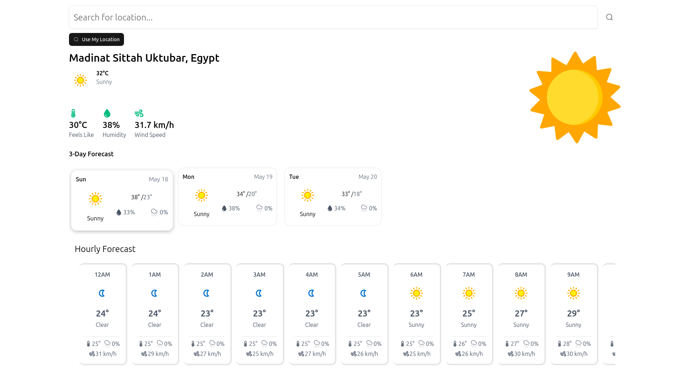

# Weather Forecast Application

A modern weather forecast application built with React and TypeScript, providing both hourly and daily weather forecasts with a clean, user-friendly interface, styling with tailwindcss and animation using motion (previously known as Framer Motion).

## Screenshot

## Features

- Hourly weather forecasts
- Daily weather forecasts
- Responsive design
- TypeScript support
- Modern UI/UX

## Technologies Used

- React
- TypeScript
- Vite
- TailwindCSS
- Motion (previously known as Framer Motion)
